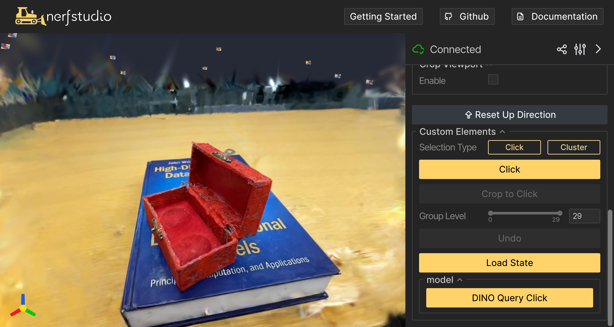
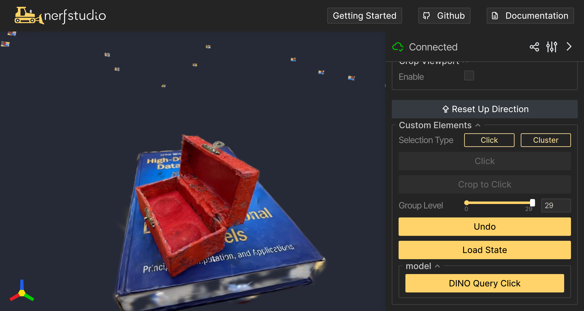
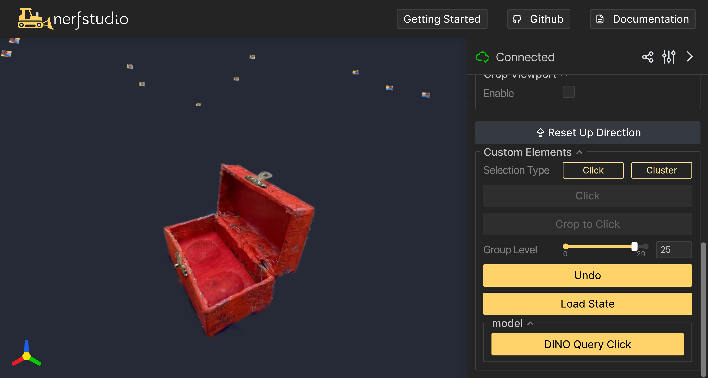
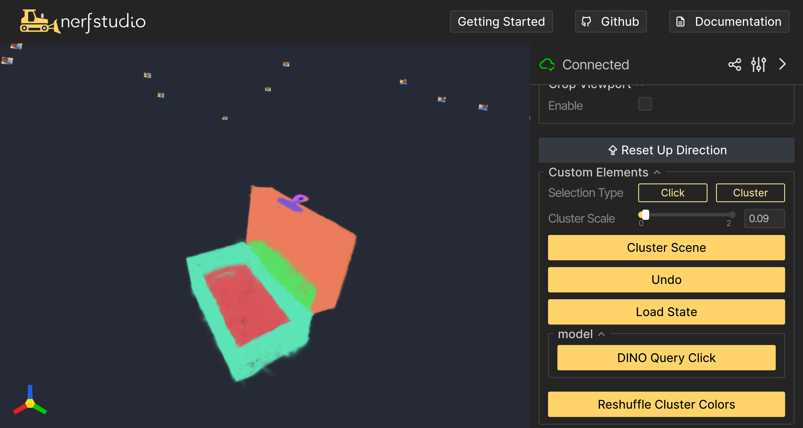

# Robot See Robot Do
[Project Page](https://robot-see-robot-do.github.io/), [Paper](https://arxiv.org/abs/2409.18121)

## Installation
Clone this repo with `git clone --recursive https://github.com/kerrj/rsrd`, which will clone submodules into `dependencies/`
### Outside Dependencies
First please install PyTorch 2.1.2 in a python 3.10 conda env with cuda version 12.0 (should also work with different torch versions but this is what we've tested). Next, install [nerfstudio](https://github.com/nerfstudio-project/nerfstudio) and [gsplat](https://github.com/nerfstudio-project/gsplat) using the instructions provided in their documentation. We use `nerfstudio` version 1.1.4 and `gsplat` version 1.4.0.

Once these are installed, install [GARField](https://github.com/chungmin99/garfield), which should simply be pip installable except for [cuML](https://docs.rapids.ai/install/), which can be pip installed with 
`pip install --extra-index-url=https://pypi.nvidia.com cudf-cu12==24.10.* cuml-cu12==24.10.*`

**TODO** cmk add robot dependencies

### Submodule Dependencies
There are a number of submodules inside the `dependencies/` folder, which can all be pip installed via `pip install -e .`

**TODO** make sure the dependencies install correctly

### Testing the install
To catch most install issues, after installation you should be able to run `ns-train garfield -h` and `ns-train dig -h` and see a formatted help output of the two training pipelines.

## Running 4D-DPM
We have published data to reproduce the paper results [here](TODO). They consist of a multi-view scan in nerfstudio format, and a `.mp4` video of the input demonstration.

### Custom data
To capture your own objects, please first scan an object of interest as described [here](https://docs.nerf.studio/quickstart/custom_dataset.html).

### Training 4D-DPM
4D-DPM consists of two overlaid models: a GARField and a dino-embedded gaussian model (which we call DiG)

1) *Train GARField* with `ns-train garfield --data <path/to/datasetname>`. This will produce an output config file inside `output/datasetname/garfield/<timestamp>/config.yml`
2) *Train DiG* with `ns-train dig --data <path/to/data/directory> --pipeline.garfield-ckpt <path/to/config.yml>`, using the output config file from the GARField training.
3) *Segment the model*: inside the viewer for DiG, you should see the following GUI:

First we need to segment the model. To do this, click on the "Click" button, then click inside the viewer window to select a point in 3D. Next, click "Crop to Click". You should see a result like this:
.
Next adjust the scale until only the object is segmented, like this:

Finally, switch to "Cluster" mode, then click "Cluster Scene". For best results pick a scale such that the fewest parts are segmented, with just the part of interest remaining.

### Reconstructing Video Motion

## Bibtex
If you find this useful, please cite the paper!
<pre id="codecell0">@inproceedings{kerr2024rsrd,
&nbsp;title={Robot See Robot Do: Imitating Articulated Object Manipulation with Monocular 4D Reconstruction},
&nbsp;author={Justin Kerr and Chung Min Kim and Mingxuan Wu and Brent Yi and Qianqian Wang and Ken Goldberg and Angjoo Kanazawa},
&nbsp;booktitle={8th Annual Conference on Robot Learning},
&nbsp;year = {2024},
} </pre>
